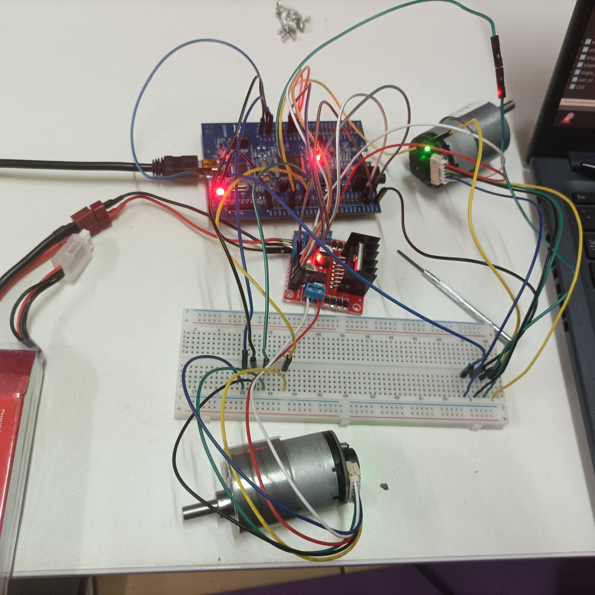

# STM32F407 Differential‑Drive Robot Base Firmware

Firmware for a two‑wheel differential‑drive robot base built on the **STM32F407G‑DISC1**.
It drives two brushed 12 V gearmotors through an **L298N** H‑bridge, closes a velocity
loop on **quadrature encoders**, reads heading from an **MPU‑6050**, and exposes a simple
line‑based command protocol over **USB CDC** for a **ROS 2 Humble** host.

> Suggested repository slug: `stm32-diffdrive-base`



*Early bench bring‑up (24 July 2025).* &nbsp;▶ **[Watch the demo video (MP4, 0:11)](photos+vods/9Dec2025.mp4)** — the base assembled on its round chassis with wheels mounted, streaming live encoder/IMU telemetry to the terminal (9 Dec 2025).

---

## Table of contents

- [Features](#features)
- [Hardware](#hardware)
  - [Bill of materials](#bill-of-materials)
  - [Pin map](#pin-map)
  - [Power & wiring](#power--wiring)
- [Firmware architecture](#firmware-architecture)
- [Motion control](#motion-control)
- [USB command protocol (ROS 2 link)](#usb-command-protocol-ros-2-link)
- [Build & flash](#build--flash)
- [ROS 2 integration](#ros-2-integration)
- [Repository layout](#repository-layout)
- [Behaviour notes & known quirks](#behaviour-notes--known-quirks)
- [License](#license)

---

## Features

- **Dual closed‑loop velocity control** — per‑motor PID on wheel angular velocity (rad/s).
- **Hardware quadrature decoding** for both wheels via STM32 timer encoder interface
  (no CPU cost, full direction sensing, ×4 resolution).
- **1 kHz PWM** speed control + GPIO direction, per motor, through the L298N.
- **Stiction/kick‑start** logic so the wheels break away cleanly at low commands.
- **Graceful stop** state machine with active braking and a synchronized two‑wheel stop.
- **Yaw estimation** from an MPU‑6050 gyro (bias‑calibrated at boot).
- **USB CDC (virtual COM) command interface** — human‑typeable and ROS‑friendly.
- Generated with STM32CubeMX / CubeIDE; all peripheral init lives in the usual `MX_*_Init()` files.

---

## Hardware

### Bill of materials

| Component | Notes |
|---|---|
| STM32F407G‑DISC1 | STM32F407VGTx, Cortex‑M4 @ 168 MHz |
| 2× 12 V DC gearmotor | ~178 rpm output, **1:56** gearbox, AB quadrature encoder |
| L298N dual H‑bridge | one channel per motor |
| MPU‑6050 (GY‑521) | 6‑axis IMU; only gyro‑Z (yaw) is used |
| LiPo battery | 2200 mAh, 11.1 V (3S), 35C, via Dean→JST |
| Inline fuse | on the battery + line |
| Linux laptop | ROS 2 Humble host (connects to CN5) |
| Windows laptop | STM32CubeIDE / CubeMX, flashing & debug (connects to CN1) |

### Pin map

| Function | STM32 pin | Peripheral |
|---|---|---|
| Motor 1 PWM (ENA) | `PD12` | TIM4_CH1 |
| Motor 1 direction (IN1 / IN2) | `PD13` / `PD14` | GPIO output |
| Motor 1 encoder A / B | `PA0` / `PA1` | TIM2_CH1 / CH2 (quadrature) |
| Motor 2 PWM (ENB) | `PE5` | TIM9_CH1 |
| Motor 2 direction (IN3 / IN4) | `PE0` / `PE1` | GPIO output |
| Motor 2 encoder A / B | `PA6` / `PA7` | TIM3_CH1 / CH2 (quadrature) |
| MPU‑6050 I²C (SCL / SDA) | `PB6` / `PB7` | I2C1 @ 100 kHz |
| Analog input | `PA5` | ADC1_IN5 *(sampled, not yet used)* |
| Status LED | `PD15` | on‑board green LED (alive blink) |
| USB — debug/flash | ST‑LINK | **CN1** mini‑B → Windows |
| USB — CDC/ROS | `PA11` / `PA12` | **CN5** micro‑B → Linux (OTG FS) |

> **Both encoders use full hardware quadrature** (TIM2 for Motor 1, TIM3 for Motor 2).
> An earlier revision temporarily read Motor 2 as a single‑phase EXTI counter on `PA7`
> while the A‑channel wire / `PA6` were damaged; that wiring has since been repaired and
> the firmware is back to dual‑channel quadrature on both wheels.

### Power & wiring

```
LiPo + (thick red) ──fuse──> L298N +12V
LiPo − (thick black) ───────> L298N GND ──┐
                                          ├── common ground
STM32 GND ────────────────────────────────┘

L298N OUT1/OUT2 ── Motor 1 winding      L298N OUT3/OUT4 ── Motor 2 winding
Encoders powered from STM32 3V3 / GND (logic-level, 3.3 V safe)
```

**Common ground is mandatory** — the battery negative, L298N GND and STM32 GND must be
tied together, or the logic/PWM/encoder signals have no shared reference. Encoders are
powered from **3V3** so their outputs stay within the MCU's safe input range.

---

## Firmware architecture

- **System clock:** 168 MHz (HSE 8 MHz → PLL ×336 ÷8 ÷2). APB1 = 42 MHz, APB2 = 84 MHz.
- **PWM:** TIM4 (APB1) and TIM9 (APB2) are prescaled to a 1 MHz timebase with `ARR = 999`,
  giving **1 kHz** PWM on both motors. Duty is set as a 0–100 % → 0–999 compare value.
- **Encoders:** TIM2 (32‑bit) and TIM3 (16‑bit) in `TIM_ENCODERMODE_TI12` (×4 decoding).
  Each control tick reads the signed counter delta, resets it, and accumulates into a
  32‑bit software counter. A per‑motor `enc_sign` normalises "forward = positive".
- **Main loop** (`main.c`) is a cooperative scheduler paced by `HAL_Delay(10)` (~100 Hz):

  | Task | Rate |
  |---|---|
  | IMU update (`MPU6050_Update`) | 100 Hz |
  | Encoder read + RPM estimate | 100 Hz |
  | PID velocity control | 50 Hz |
  | Command parsing / reports | event‑driven |

- **USB CDC** (`usbd_cdc_if.c`) handles all host I/O: it parses incoming command lines in
  the RX callback and provides `CDC_Printf()` / `CDC_Write()` helpers for output.

---

## Motion control

Velocity commands are **wheel angular velocity in rad/s**, clamped to **±18 rad/s**
(≈ ±170 rpm, near the motor's ~178 rpm ceiling). Each motor is an independent `Motor`
struct (`motor_control.h`) carrying its timers, direction pins, PID gains and state.

The `pid_control()` routine does more than a textbook PID:

- **Acceleration‑limited ramp** (`ACC_LIMIT ≈ 25 rad/s²`) so setpoints don't step.
- **PI(D) loop** per motor (defaults `kp = 0.30`, `ki = 0.02`, `kd = 0.00`).
- **Kick‑start** — forces a minimum PWM (`PWM_MIN = 28 %`) burst until the encoder confirms
  the wheel actually moved, defeating static friction / the driver dead‑zone.
- **Stop state machine** — `RUN → STOPPING → STOPPED`, with active braking (IN1=IN2=high)
  and a synchronized two‑wheel stop when both targets are zero.
- **RPM filtering** — measured RPM is low‑pass filtered (`α = 0.60`) and clamped (±220 rpm).

Encoder counts per output‑shaft revolution are measured empirically:
`COUNTS_PER_REV_M1 = 1240.00`, `COUNTS_PER_REV_M2 = 1239.67`. Small per‑wheel
velocity trims (`VEL_SCALE_*`) let you balance the two sides.

---

## USB command protocol (ROS 2 link)

Connect to the **CN5** virtual COM port (e.g. `/dev/ttyACM0` on Linux). Commands are
ASCII, **one per line** (`\n` or `\r\n` terminated). Baud rate is irrelevant for USB CDC.

**Commands (host → board):**

| Command | Effect |
|---|---|
| `m <left> <right>` | Set both wheel velocities in rad/s (main drive command) |
| `M1 <v>` / `M2 <v>` | Set a single motor's velocity in rad/s |
| `e` / `E` | Emit one `ENC` feedback line |
| `z` / `Z` | Reset: stop motors, zero encoder counters, clear PID state |
| `d 1` / `d 0` | Turn the debug telemetry stream on / off |
| `i` | Run an MPU‑6050 / I²C bus diagnostic dump |

**Feedback (board → host):**

```
ENC <m1_count> <m2_count> <gz_rad_s> <yaw_rad>
```

- `m1_count`, `m2_count` — accumulated encoder counts (relative to the last `z`).
- `gz_rad_s` — yaw rate (rad/s), `yaw_rad` — integrated heading (wrapped to ±π).

> The `ENC` line is sent **on request** — poll it by sending `e` at your desired odometry
> rate (e.g. 50 Hz). Nothing is streamed automatically except the optional `d 1` debug text.

**Example session:**

```
z               # reset pose/counters
m 3.0 3.0       # drive straight, both wheels 3 rad/s
e               # -> ENC 152 149 0.0123 0.0041
m 2.0 -2.0      # spin in place
e               # -> ENC 210 -205 0.812 0.153
m 0 0           # stop
```

---

## Build & flash

**Requirements:** STM32CubeIDE (bundled Arm GCC + ST‑LINK tools). The board's ST‑LINK
(CN1 mini‑B) handles flashing and debugging.

1. Open **STM32CubeIDE** → *File ▸ Open Projects from File System…* → select this folder.
2. Build (`Project ▸ Build`, or the hammer icon). Output goes to `Debug/`.
3. Connect the board via **CN1 (mini‑B)** and flash (`Run` / `Debug`).
4. The `.ioc` (`DC_Motor_Control.ioc`) can be reopened in CubeMX to regenerate peripheral
   init — user code lives inside the `/* USER CODE BEGIN/END */` guards and is preserved.

Linker scripts: `STM32F407VGTX_FLASH.ld` (production) and `STM32F407VGTX_RAM.ld`.
OpenOCD debug config: `DC_Motor_Control Debug.cfg`.

For ROS use, also plug **CN5 (micro‑B)** into the Linux host — this enumerates the CDC
virtual COM port used by the command protocol above.

---

## ROS 2 integration

The Linux (ROS 2 Humble) side runs a small **serial bridge node** that:

1. Opens the CN5 CDC port.
2. Converts `/cmd_vel` (or per‑wheel setpoints) into `m <left> <right>` lines.
3. Polls `e` and parses `ENC …` lines into wheel positions + IMU yaw.
4. Publishes odometry using your robot's **wheel radius** and **track width**, e.g.:

   ```
   wheel_angle_rad = 2π · (encoder_count / COUNTS_PER_REV)
   ```

   then standard differential‑drive kinematics from the left/right wheel deltas, fused
   with `yaw_rad` from the IMU for heading.

(The bridge node itself lives in the ROS 2 workspace on the Linux host, not in this repo.)

---

## Repository layout

```
DC_Motor_Control_v2/
├── Core/
│   ├── Inc/               # headers: main.h, motor_control.h, mpu6050.h, *.h
│   └── Src/
│       ├── main.c         # scheduler + motor control, PID, RPM, set_motor_speed
│       ├── tim.c          # TIM2/TIM3 encoders, TIM4/TIM9 PWM
│       ├── gpio.c         # pin configuration
│       ├── mpu6050.c      # IMU driver (yaw)
│       ├── adc.c, i2c.c, dma.c
│       └── stm32f4xx_it.c # interrupt handlers
├── USB_DEVICE/App/
│   ├── usbd_cdc_if.c      # CDC command parser + ENC/telemetry output
│   └── usbd_desc.c, usb_device.c
├── Drivers/               # STM32 HAL + CMSIS (vendor)
├── Middlewares/           # ST USB Device library (vendor)
├── DC_Motor_Control.ioc   # CubeMX project
├── STM32F407VGTX_FLASH.ld / _RAM.ld
└── README.md
```

---

## Behaviour notes & known quirks

- **Two‑wheel "boost".** When *both* wheels are commanded non‑zero, each target velocity is
  multiplied (≈3× driving straight, ≈5× spinning) before the loop and re‑clamped to ±18 rad/s.
  This makes the base very responsive but means the commanded rad/s **magnitude is not honoured
  faithfully** when both wheels move — position odometry (from encoder counts) stays correct,
  but velocity tracking does not. Revisit this if you want strict `cmd_vel` compliance.
- **`ENC` is poll‑based** — the host must send `e` for each report.
- **`PA5` / ADC1_IN5** is sampled into a DMA buffer but not consumed — reserved for future
  battery‑voltage monitoring.
- **Blocking I²C** — the MPU‑6050 read is a blocking HAL call in the main loop (~1–2 ms).
- **Legacy fossils** — a few commented‑out DWT/EXTI debounce macros remain in `main.c` from the
  earlier single‑phase Motor‑2 experiment; they are inert and safe to delete.
- **Boot calibration** — the gyro bias is measured for ~1 s at startup; **keep the robot still**
  for a second after reset/power‑on.

---

## License

Portions generated by STMicroelectronics tooling are covered by the ST license terms in the
`LICENSE` files under `Drivers/` and `Middlewares/`. Application code in `Core/` and
`USB_DEVICE/App/` is yours to license as you see fit — add your chosen license here.
